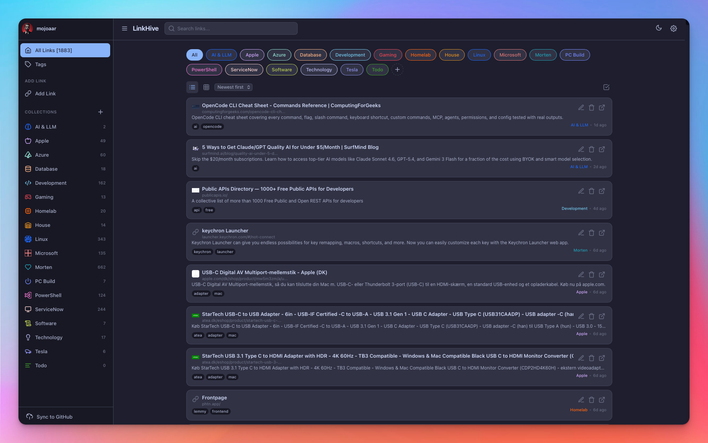
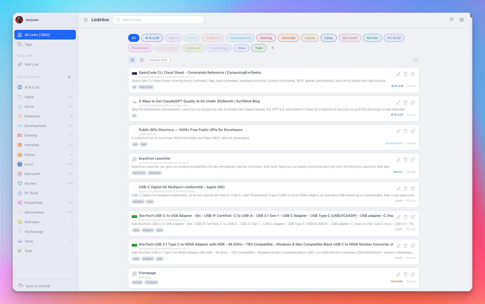
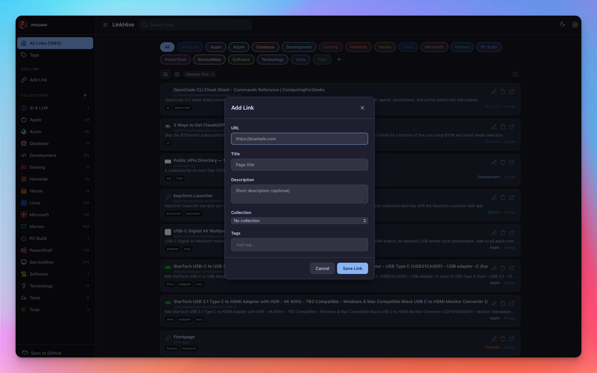
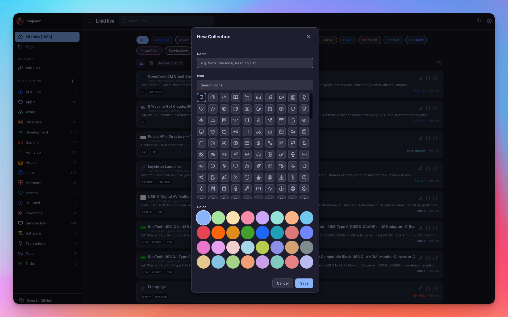
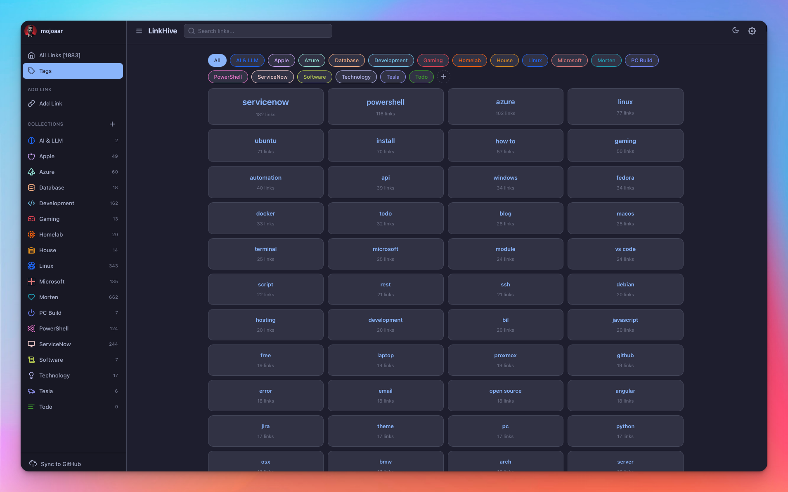

# LinkHive

**Never lose a link again.** A privacy-first, client-side link manager that works offline.

[](LICENSE)
[](#pwa-support)

---

## Features

- **Client-side only** — no server, no database, no signup. Everything stays in your browser
- **Offline-first** — full PWA with service worker caching. Works without internet
- **GitHub sync** — back up your links to a private GitHub repo (PAT auth)
- **Collections** — organize links with custom icons, colors, and names
- **Tags** — full tag system with search and filtering
- **Rich import** — import from Raindrop.io CSV exports (auto-creates collections)
- **Dark & light themes** — Catppuccin, Dracula, Nord — all with light and dark variants
- **Server config** — deploy with `config.json` for pre-configured GitHub sync
- **Responsive** — works great on desktop, tablet, and mobile
- **Zero dependencies** — pure HTML, CSS, and JavaScript. No npm, no build step

## Screenshots

<p align="center">
  
  
</p>
<p align="center">
  
  
</p>
<p align="center">
  
</p>

---

## Quick Start

1. Open `index.html` in your browser — or serve the directory with any static web server
2. Create a profile (local storage, or GitHub with PAT)
3. Start saving links

### Deploy to a web server

Copy `config.example.json` to `config.json` and fill in your values:

```json
{
  "githubToken": "ghp_...",
  "repo": "mojoaar/linkhive-data",
  "branch": "main",
  "title": "My Links",
  "description": "Personal link collection",
  "author": "Your Name"
}
```

The app auto-detects `config.json` on load. All GitHub fields become server-managed and locked in settings.

---

## Data storage

| Mode | Where | Sync |
|------|-------|------|
| **Local** | IndexedDB (your browser) | None |
| **GitHub** | IndexedDB + GitHub repo | Manual and auto-sync on changes |

Data is stored per-origin in IndexedDB. GitHub-synced data lives in `data/` at the repo root.

---

## Import from Raindrop.io

1. Export your Raindrop bookmarks as CSV
2. Go to Settings → **Import from Raindrop (CSV)**
3. Select your CSV file

Collections are auto-created from Raindrop folders with a random color and bookmark icon. Duplicate URLs are skipped.

---

## PWA Support

LinkHive is a Progressive Web App. Install it to your home screen on mobile or desktop for offline access and native-like experience.

---

## Development

No build tools required. Open `index.html` directly or serve with any static server:

```bash
python3 -m http.server 8000
# or
caddy file-server --listen :8000
```

### File structure

```
linkhive/
├── index.html              # SPA shell
├── config.example.json     # Server config template
├── manifest.json           # PWA manifest
├── sw.js                   # Service worker
├── css/
│   ├── base.css
│   ├── themes.css
│   └── components.css
├── js/
│   ├── app.js              # Main app, router, sync
│   ├── config.js           # Constants, icons, colors
│   ├── configStore.js      # Local + server config
│   ├── icons.js            # SVG icon renderer (350+ icons)
│   ├── linkStore.js        # Link & collection CRUD
│   ├── storage.js          # IndexedDB + GitHub backend
│   ├── themes.js           # Theme engine
│   └── ui/                 # UI modules
│       ├── forms.js        # URL metadata parser
│       ├── linkGrid.js     # Link card grid/list
│       ├── modals.js       # Settings, link, collection modals
│       └── sidebar.js      # Navigation, profile
│   └── utils/
│       ├── dom.js          # DOM helpers
│       └── github.js       # GitHub API client
└── assets/
```

---

## Credits

LinkHive uses icon paths derived from [**Lucide**](https://lucide.dev) — 300+ general-purpose icons ([ISC License](https://github.com/lucide-icons/lucide/blob/main/LICENSE)).

All icons are embedded as inline SVG paths in `js/icons.js` — no external icon dependencies at runtime.

---

## Troubleshooting

### Reset everything

If you need to start fresh, paste this in the DevTools console (F12 → Console):

```js
localStorage.removeItem('linkhive_config');
localStorage.removeItem('linkhive_profiles');
localStorage.removeItem('linkhive_active_profile');
indexedDB.deleteDatabase('linkhive_db');
location.reload();
```

This wipes your config, all link data, and reloads the app. You'll see the onboarding screen on the next load.

---

## License

MIT © [Morten Johansen](https://johansen.foo)

---

## Sponsor

If you find LinkHive useful, consider [buying me a coffee](https://buymeacoffee.com/mojoaar).

---

## Changelog

### [v0.2.0](https://github.com/mojoaar/linkhive/releases/tag/v0.2.0) — Browser Extensions

- Add Chrome extension (MV3) with settings form (token, repo, branch)
- Add link saving with collection and tag support from the popup
- Add existing link detection — pre-fills form with current data, button changes to "Update"
- Add dark/light mode icon switching (blue cloud on light, white cloud on dark)
- Add pull-before-push sync — web app now merges extension-added links on sync
- Add host_permissions for GitHub API access in Chrome MV3
- Fix GitHub sync to merge remote data instead of overwriting
- Remove Firefox extension (Chrome-only for now)
- Use downloaded cloud icon for toolbar button
- Various stability fixes for XHR calls and timeout handling

### [v0.1.6](https://github.com/mojoaar/linkhive/releases/tag/v0.1.6) — Bugfix

- Fix syntax error in `github.js` blocking sync — remove orphaned duplicate code from 409 retry edit
- Fix sync lock deadlock — add try/catch guard around `_pushToGithub`, single lock point in `_doPush`
- Fix duplicate `_doPush` causing infinite recursion and toast storms
- Fix 409 SHA conflict — retry up to 4 times with 1s delays, reuse pre-encoded base64 in retries
- Fix `pushFile` error handling — `getFile` catch no longer masks `putFile` errors
- Fix stale collection counts after bulk move — update `_linkCounts` cache on collectionId change
- Fix SW cache — bump to `v3` and add PNG favicons to cache list
- Add longer error toasts (10s) with copy-to-clipboard button
- Add favicon PNGs (32×32, 192×192, 512×512, 180×180) for Full PWA + iOS support
- Add toast validation messages when sync fails due to missing GitHub config
- Remove all Simple Icons (si- prefix) — Lucide only
- Remove unused `crypto.js` module (~100 lines)
- Deduplicate 149 lines of CSS in list view section
- Add 80+ new Lucide icons across 8 categories
- Add troubleshooting section to README with reset commands

### [v0.1.5](https://github.com/mojoaar/linkhive/releases/tag/v0.1.5) — Bugfix

- Fix concurrent auto-sync pushing multiple files causing 409 SHA conflicts — added sync lock with deferred queue
- Fix 409 retry in `putFile()` — now retries up to 3 times instead of once

### [v0.1.4](https://github.com/mojoaar/linkhive/releases/tag/v0.1.4) — Bugfix

- Fix 409 SHA conflict during GitHub sync — retries once with fresh SHA when file was modified concurrently
- Fix collection link counts not updating after bulk-move — cache now decrements/increments on collection change

### [v0.1.3](https://github.com/mojoaar/linkhive/releases/tag/v0.1.3) — Bugfix

- Fix bulk move ("Move to..." dropdown) not triggering auto-sync to GitHub. All mutation paths now covered.

### [v0.1.2](https://github.com/mojoaar/linkhive/releases/tag/v0.1.2) — Bugfix

- Fix collections missing after GitHub pull during onboarding. `importData()` now holds references to all IDBRequest objects to prevent garbage collection from aborting writes before the transaction commits.

### [v0.1.1](https://github.com/mojoaar/linkhive/releases/tag/v0.1.1) — Bugfix

- Fix IndexedDB transaction error ("transaction is inactive or finished") during GitHub pull on first onboarding. Rewrote `importData()` to use a single transaction spanning both object stores instead of two async-nested transactions.

### [v0.1.0](https://github.com/mojoaar/linkhive/releases/tag/v0.1.0) — Initial Release

- Client-side link manager with IndexedDB storage
- GitHub sync via Personal Access Token (chunked file storage)
- Collections with custom icons (350+ Lucide + Simple Icons) and colors (32)
- Full tag system with search, filtering, and tag cloud
- Raindrop.io CSV import with auto-collection creation
- Dark/light themes: Catppuccin, Dracula, Nord
- PWA support with service worker offline caching
- Server config via `config.json` for pre-configured deployments
- Bulk select, move, and delete in list view
- Link metadata auto-fetch (title, description, favicon)
- Responsive design — mobile, tablet, desktop
- Zero dependencies — pure HTML, CSS, JavaScript
